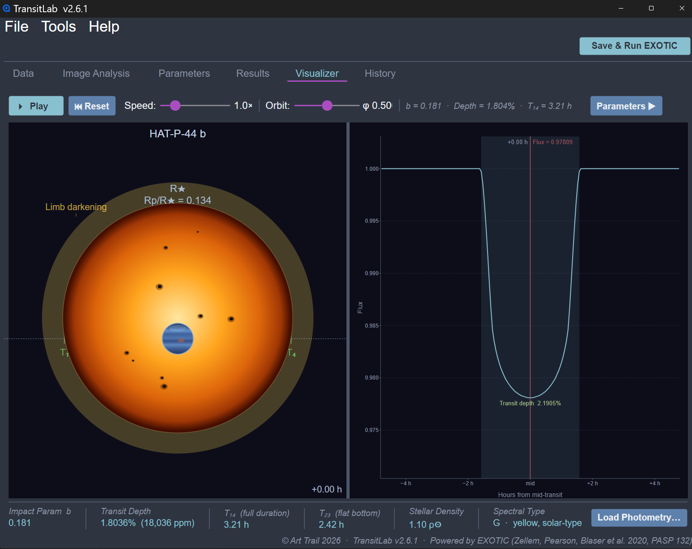
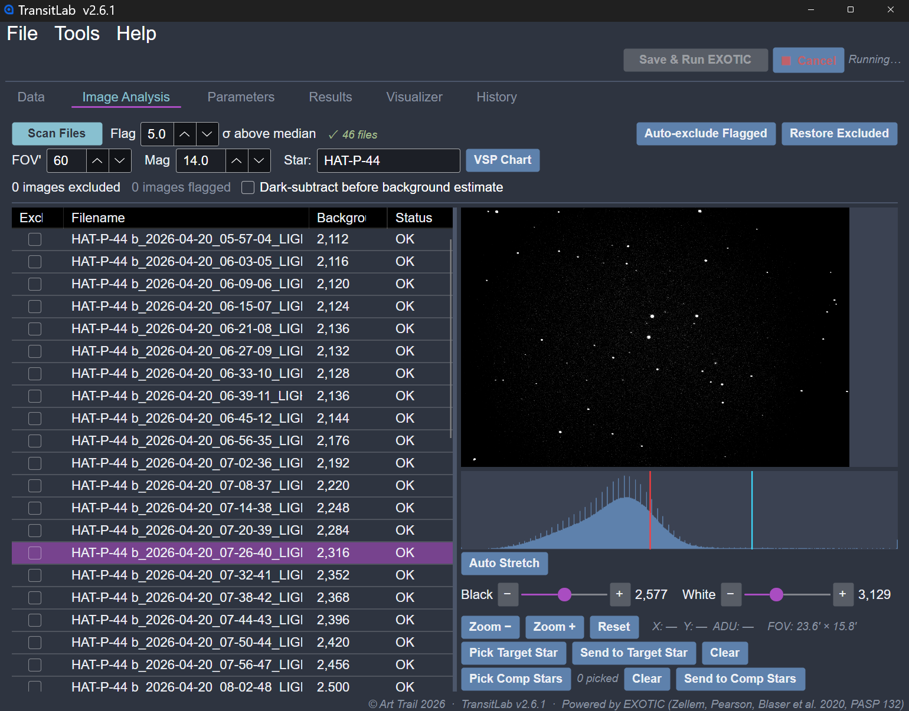
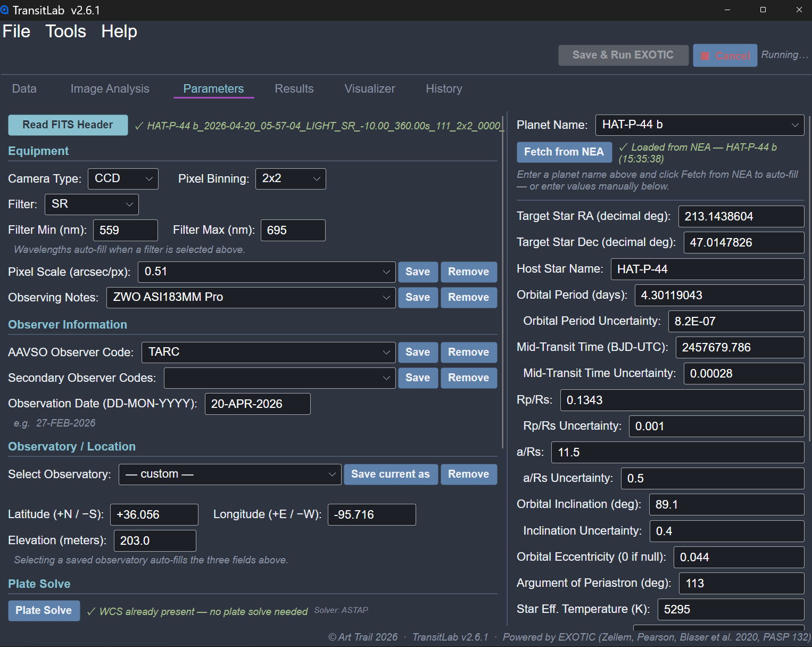
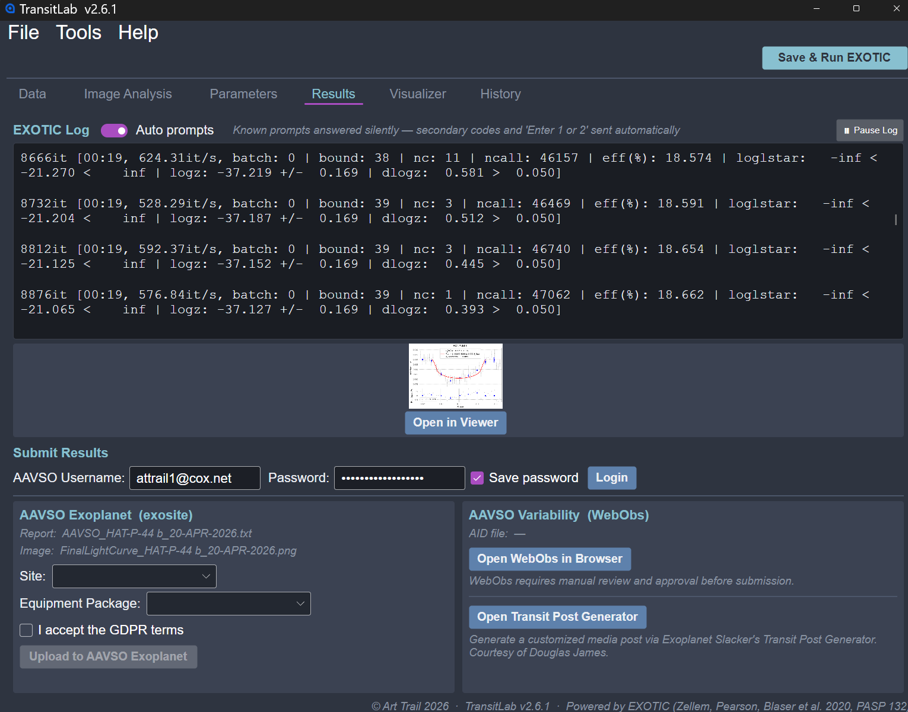
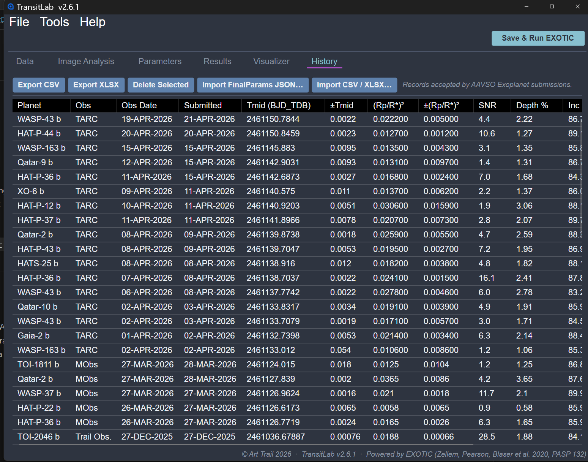

# TransitLab

**TransitLab** is a Windows desktop launcher and workflow assistant for the [EXOTIC](https://github.com/rzellem/EXOTIC) exoplanet transit reduction pipeline. It guides you through every step of a reduction run — from loading raw FITS frames to submitting results to AAVSO — all from a single tabbed interface.

> Powered by EXOTIC (Zellem, Pearson, Blaser et al. 2020, PASP 132)

---

## Screenshots

*Transit geometry visualizer with real-time animated transit preview and light curve*

*Image Analysis tab — scan, flag, and exclude frames; pick target and comparison stars*

*Parameters tab — automatic target lookup from the NASA Exoplanet Archive*

*Results tab — EXOTIC output log and AAVSO submission*

*Session history browser with sortable observation records*

---

## Features

- **Guided workflow** — tabbed interface walks you through Data → Image Analysis → Parameters → Results
- **Automatic plate solving** — via astrometry.net (online) or ASTAP (local, offline)
- **NASA Exoplanet Archive integration** — target parameters fetched automatically by planet name
- **AAVSO comparison star selection** — comparison stars fetched and selected automatically
- **Transit geometry visualizer** — real-time animated transit preview with Mandel & Agol light curve physics
- **Session history** — browse, export, and import past reduction records
- **Automation mode** — unattended reduction; monitors a folder and runs the full pipeline automatically when frames stop arriving
- **Python & EXOTIC setup wizard** — install, upgrade, or uninstall EXOTIC without touching the command line
- **AAVSO submission** — log in and upload results to AAVSO Exoplanet Watch directly from the app

---

## Requirements

| | |
|---|---|
| **OS** | Windows 10 (version 1607) or later, 64-bit |
| **Python** | 3.8 or later (3.10.x recommended) |
| **EXOTIC** | Installed via the built-in setup wizard |
| **.NET** | Not required — runtime is bundled in the download |

---

## Installation

1. Download the latest release: **[TransitLab-v2.6.1-win-x64.zip](https://github.com/ArtTrail/TransitLab/releases/latest)**
2. Extract the zip to any folder
3. Run `TransitLab.exe`
4. Open **Tools → Python & EXOTIC Setup** and click **Check System** to verify or install Python and EXOTIC

No installer required. No .NET installation required.

---

## Getting Started

1. Load your calibrated FITS frames in the **Data** tab
2. Scan and review frames in the **Image Analysis** tab
3. Enter target and equipment details in the **Parameters** tab (or let TransitLab fetch them automatically)
4. Click **Save & Run EXOTIC** in the top bar
5. Review the light curve in the **Results** and **Visualizer** tabs
6. Submit to AAVSO directly from the Results tab

See the built-in User Guide (**Help → User Guide**) for full documentation.

---

## About

© Art Trail 2026  
Built on [EXOTIC](https://github.com/rzellem/EXOTIC) — Zellem, Pearson, Blaser et al. 2020, PASP 132, 1017  
Developed with [Avalonia UI](https://avaloniaui.net) and .NET 8
